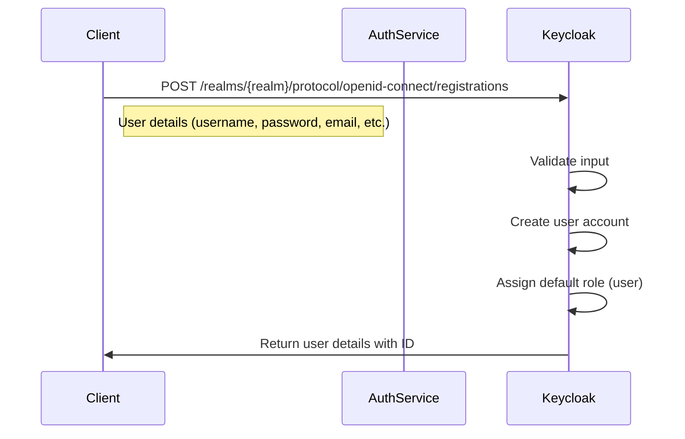
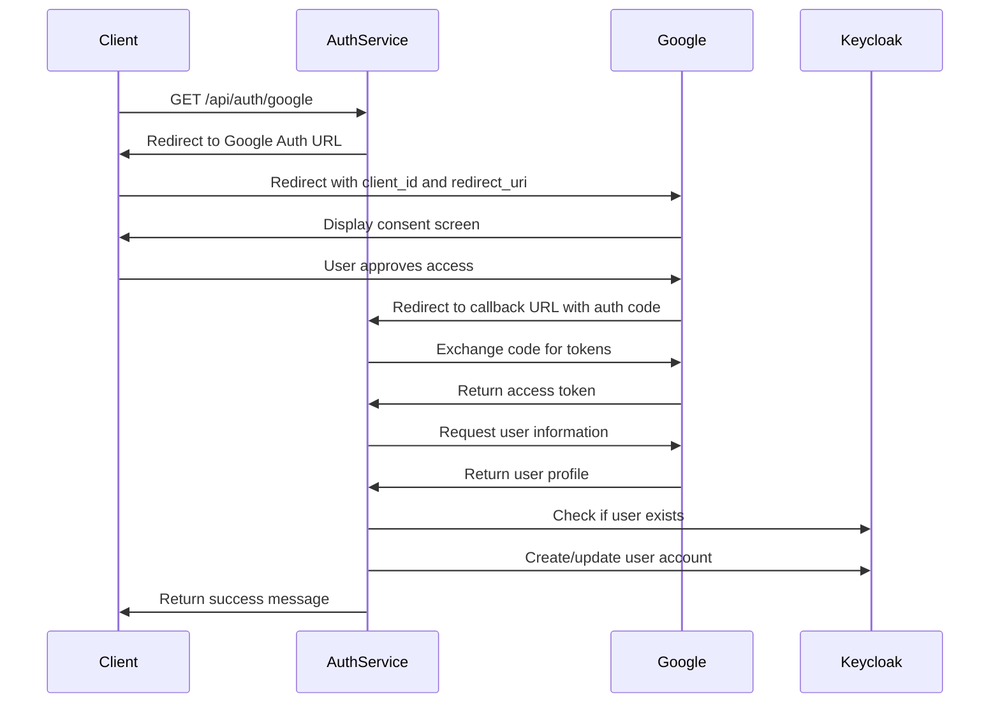
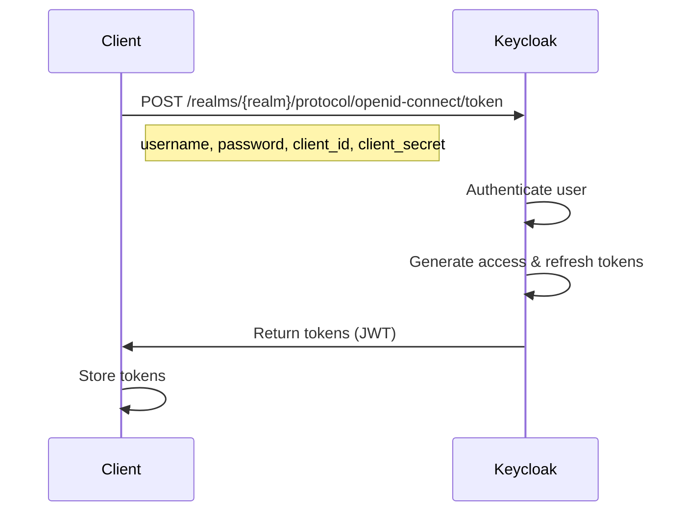
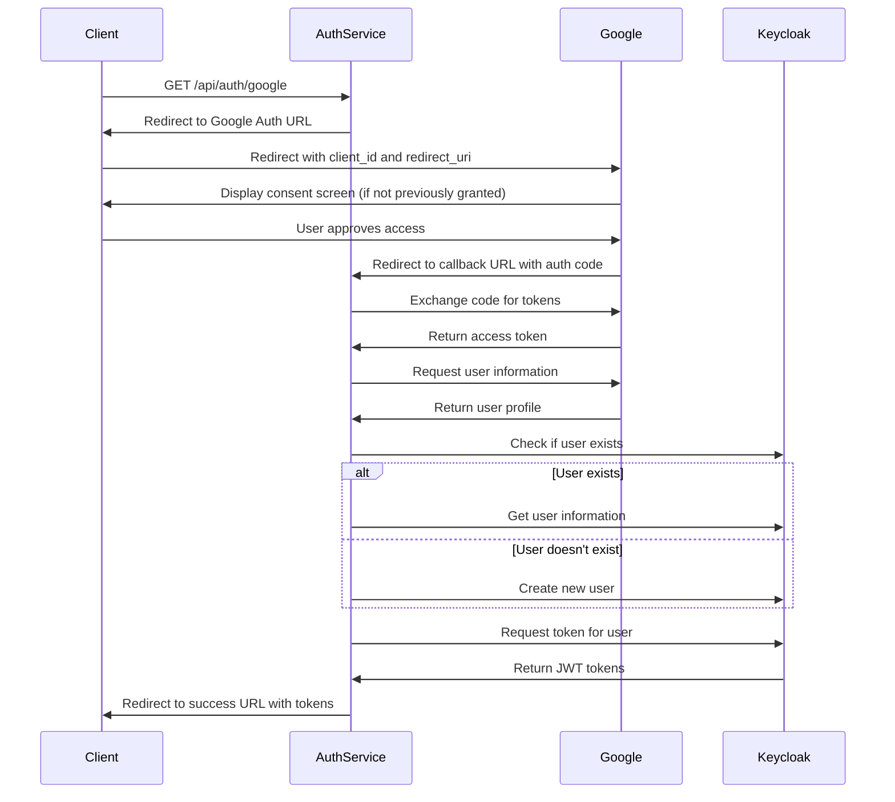
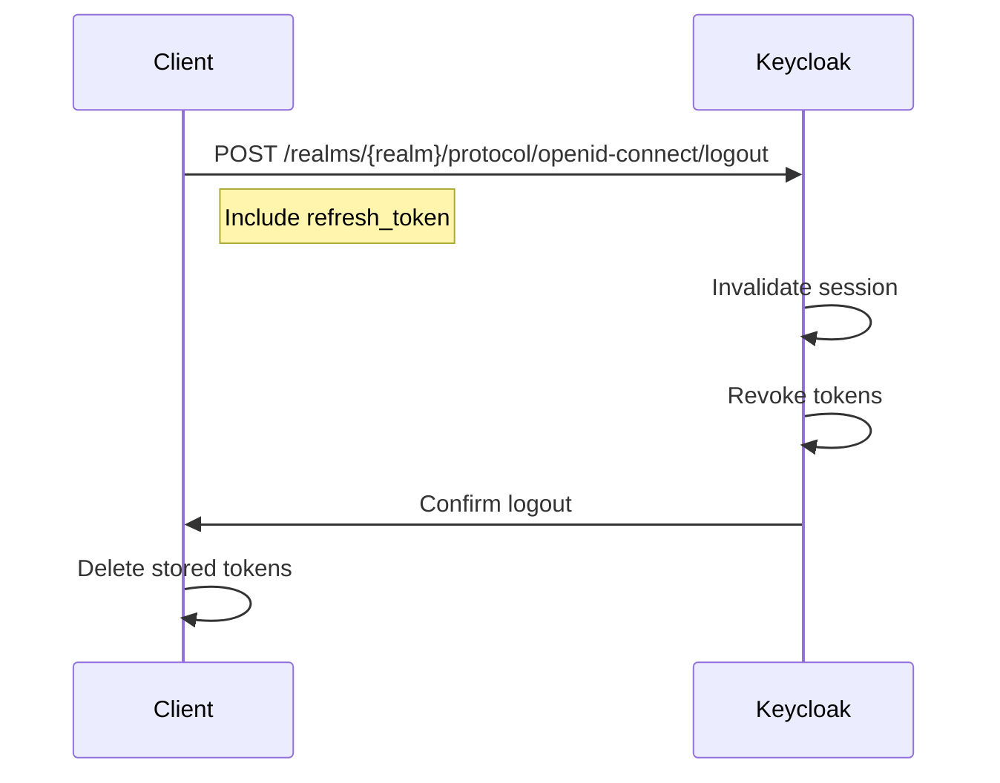
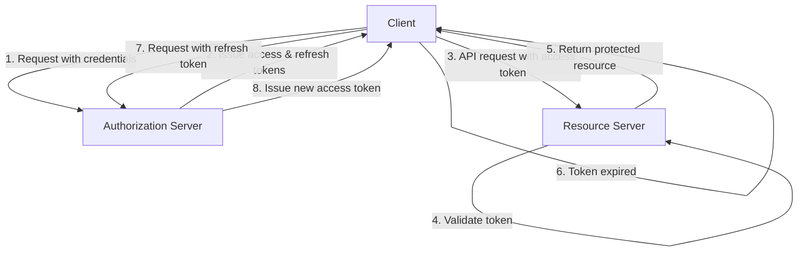
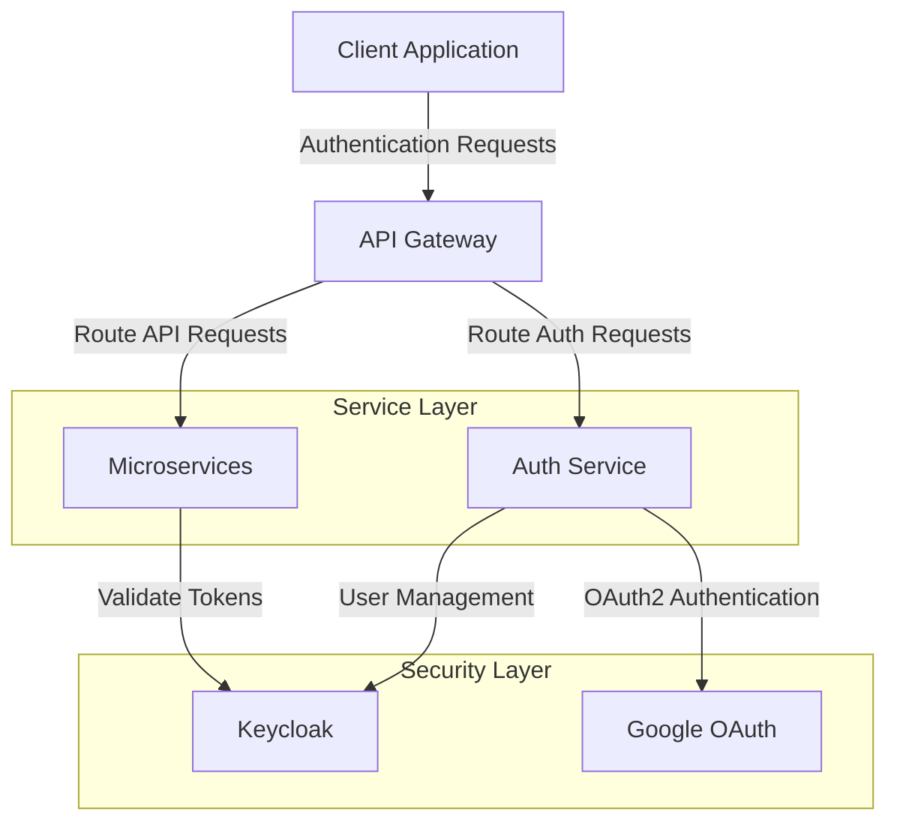
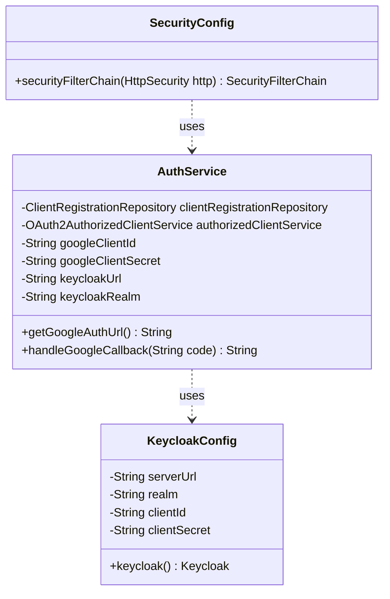
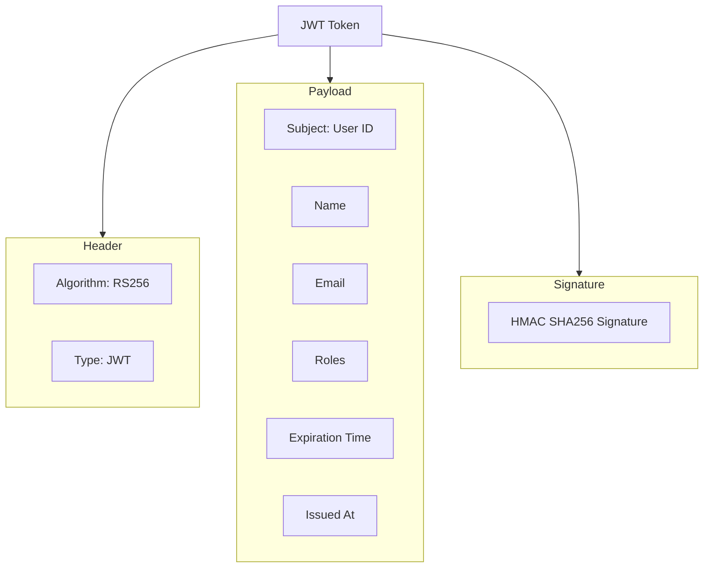

# Authentication System Documentation

This document provides detailed information about the login, logout, and signup features of this e-commerce project for developers.

## Core Components

1. **Auth Service**: 
   - Coordinates authentication flows
   - Interfaces with Keycloak for identity management
   - Provides OAuth2 integration with Google

2. **Keycloak**:
   - Handles user registration, login, and session management
   - Manages roles and permissions
   - Issues JWT tokens for authentication

## Authentication Flows

### 1. Signup/Registration

The system supports user registration through:

- **Keycloak Direct Registration**:
  - Endpoint: `POST /realms/{realm}/protocol/openid-connect/registrations`
  - Required fields: username, email, password, firstName, lastName
  - Optional custom attributes like phoneNumber
  - New users are automatically assigned the "user" role

- **Google OAuth2 Registration**:
  - Initiated via `GET /api/auth/google`
  - User is redirected to Google's consent screen
  - After approval, Google redirects to `/api/auth/google/callback` with an authorization code
  - Auth Service exchanges the code for an access token and retrieves user information
  - The service creates/updates the user in Keycloak

#### Direct Registration Sequence Diagram

#### Google OAuth2 Registration Sequence Diagram

### 2. Login

The system supports multiple login methods:

- **Keycloak Direct Login**:
  - Endpoint: `POST /realms/{realm}/protocol/openid-connect/token`
  - Parameters: grant_type=password, client_id, client_secret, username, password
  - Returns access_token, refresh_token, expires_in, token_type, and id_token

- **Google OAuth2 Login**:
  - Same flow as Google Registration
  - Flow is handled by Spring Security's OAuth2 login mechanism
  - After successful authentication, redirects to `/api/auth/google/success`

#### Direct Login Sequence Diagram

#### Google OAuth2 Login Sequence Diagram

### 3. Logout

- **Token Invalidation**:
  - Endpoint: `POST /realms/{realm}/protocol/openid-connect/logout`
  - Requires the refresh_token to invalidate the session
  - Client must also discard the tokens from local storage

#### Logout Sequence Diagram

## Token Management

- **Access Token**: JWT token with a default lifespan of 900 seconds (15 minutes)
- **Refresh Token**: Lasts 86400 seconds (24 hours) and can be used to obtain new access tokens
- **Token Validation**: Performed by Spring Security using Keycloak's public key

### Token Flow Diagram

## Architecture Diagram

## Security Configuration

The `SecurityConfig` class in Auth Service configures:
- CSRF protection (disabled for API endpoints)
- Public endpoints (`/api/auth/**` and `/actuator/**`)
- OAuth2 login configuration with success URL

### Configuration Class Structure

## For Developers

1. **Integration Points**:
   - Use the JWT token in the `Authorization` header with `Bearer` prefix for authenticated requests
   - Token contains user information and roles for authorization

2. **Development Setup**:
   - Keycloak runs on port 9090
   - Auth Service runs on port 8081
   - Environment variables required:
     - GOOGLE_CLIENT_ID, GOOGLE_CLIENT_SECRET (for Google OAuth)
     - KEYCLOAK_URL, KEYCLOAK_REALM, KEYCLOAK_CLIENT_ID, KEYCLOAK_CLIENT_SECRET

3. **Testing Authentication**:
   - Refer to API_TEST_SCENARIOS.md for detailed examples of authentication requests and responses
   - Preconfigured test users: "admin" (password: "admin") and "user" (password: "user")

### JWT Token Structure

## Implementation Notes

1. The Auth Service acts primarily as an adapter between the client application and Keycloak.
2. Google OAuth integration provides an alternative registration/login path.
3. All tokens are JWTs that can be validated without calling back to Keycloak on every request.
4. Token renewal happens through the refresh token mechanism.

